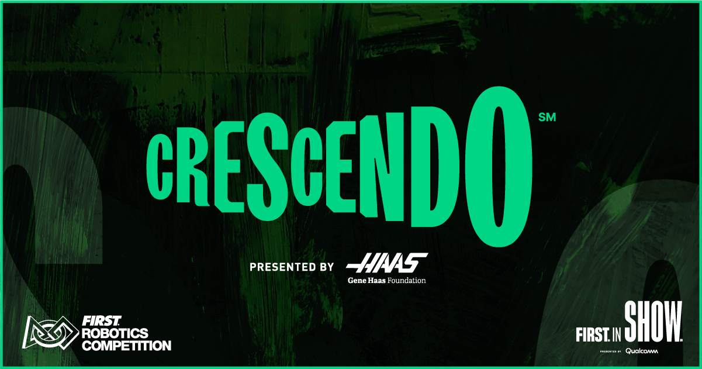

# 2024_Offbot_Code - FRC Team 3255's 2024 Offbot
Jump into the code [`here!`](src/main/java/frc/robot)

This robot will compete at the following competitions: 
- Battle at the Border
- [Beach Blitz](https://www.thebluealliance.com/event/2024cabl)

## View Our Robots in Action!
- [Instagram](https://www.instagram.com/frcteam3255/) 
- [YouTube (Primary)](https://www.youtube.com/@FRC3255)
- [YouTube (Clips)](https://www.youtube.com/@FRC3255Clips)
- [Build Thread (Chief Delphi)](https://www.chiefdelphi.com/t/frc-3255-supernurds-2024-build-thread/447181)
- [Website](https://supernurds.com)

## What is CRESCENDO?

CRESCENDO, presented by Haas, is the 2024 Season of the FIRST Robotics Competition. Each season has its unique objectives and limitations. 
Students have 6 weeks to construct a robot to compete in the season. Once the 6 weeks are up, teams compete at regional or district-level 
competitions (depending on region) to qualify for the FIRST Championship in Houston, Texas.

Interested in learning more about CRESCENDO? Visit [FIRST's website](https://www.firstinspires.org/robotics/frc/game-and-season) for more details!

## Code Details
This offseason, we chose to control our robot using a state machine! Prior to staring our code, we mapped out and dicussed every state that our robot could be in during a match and how those states should interact with eachother. This allowed us to create a framework of our commands, sort of like pseudocode, before we even opened VSCode!

Check out our diagram below or visit the interactive link [here.](https://www.tldraw.com/ro/DX06u039erL_iV6q0ARSn?d=v-1103.-1504.5212.2506.page)

## Controls
Coming Soon!

## Robot Simulation
Coming Soon!
